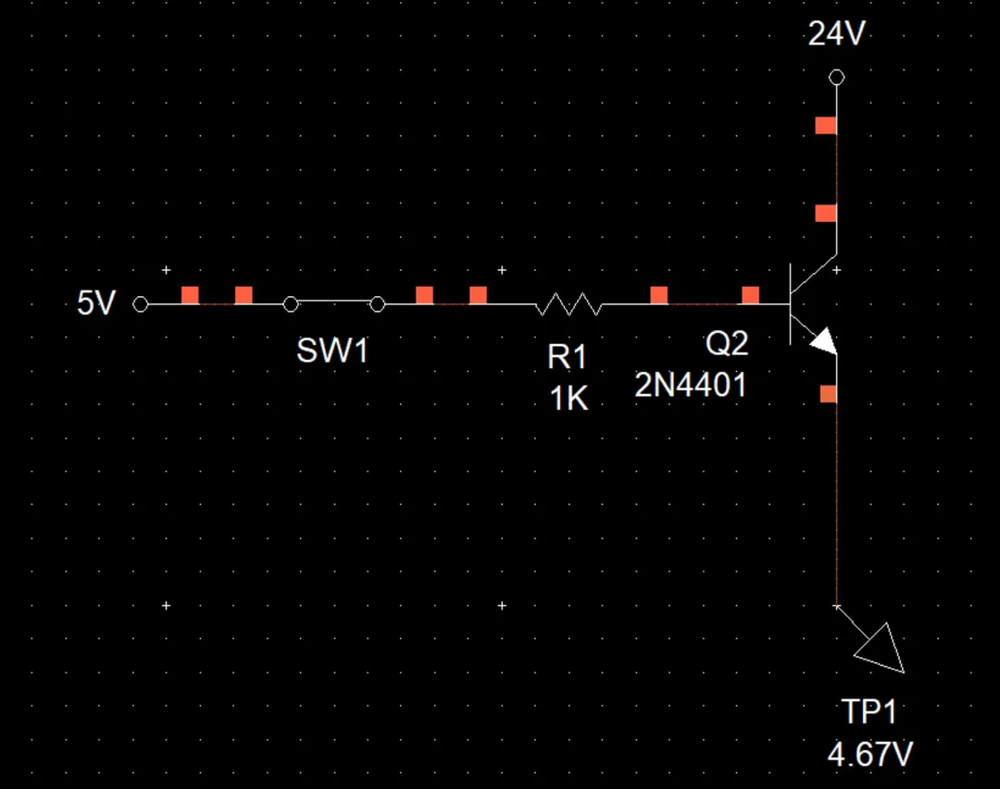
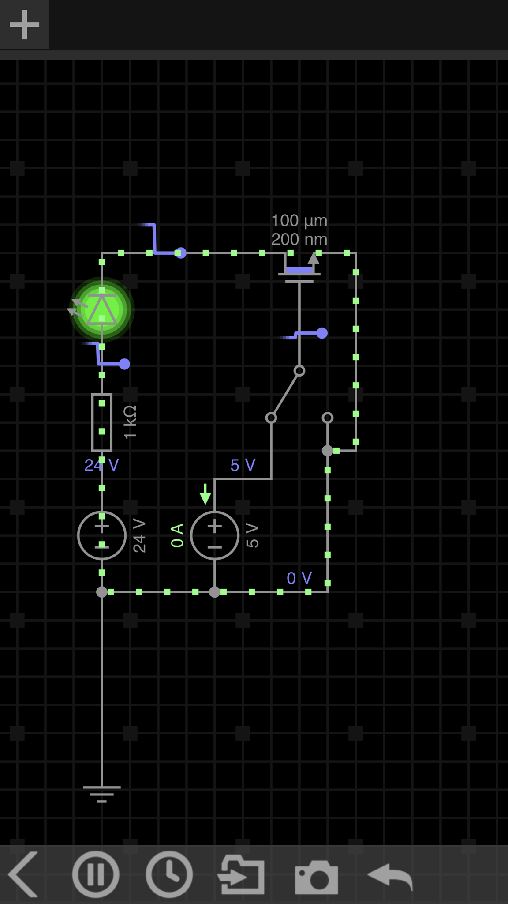
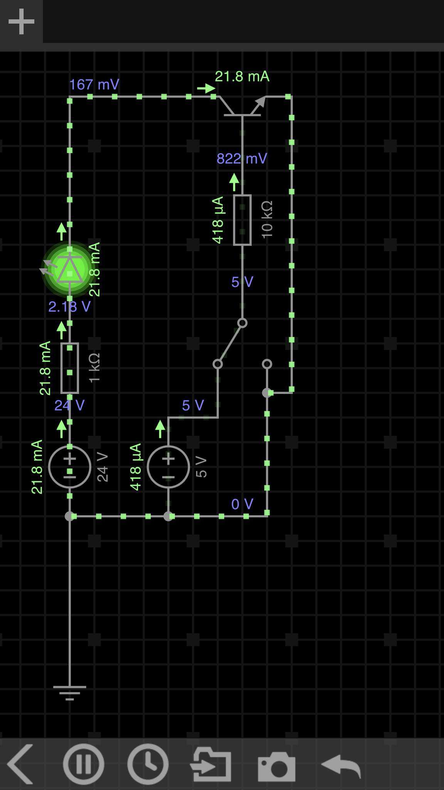

[Go to AskElectronics](https://www.reddit.com/r/AskElectronics/)

[r/AskElectronics](https://www.reddit.com/r/AskElectronics/)

A subreddit for practical questions about component-level electronic circuits: design, repair, component buying, test gear and tools.

---

854K Members 66 Online

• 5 yr. ago

[domiluci](https://www.reddit.com/user/domiluci/)

Engineering Scientist

# Using +5V Logic To Control A +24V Line Using A Transistor Like A Cutoff Valve (Just Doing A Double Check)

")

So I just need a quick confirmation double check because this seems a bit weird. But I'm trying to find the simplest way to control the flow of a +24V signal line with +5V logic. I thought I could just use a transistor like a cutoff valve; transistor goes on, bridges the gap, +24V flows. Boom. But whether I use an NPN or PNP, I can't seem to get the simulator to show +24V on both sides of the transistor. So I don't know if I'm missing something or if the simulator isn't showing the right voltage.

I'm running out of real estate on the board for the rest of this project, and I'm trying to add a new feature to it with the smallest footprint and part count possible. Otherwise I'd honestly just use a submini relay. But I know this will work because I've done this before with something a couple years back to switch ONLY the higher voltage logic lines with +5V logic (without needing to run the +24VDC and GND power lines through as well). I just don't know what I'm missing this time.

If someone could just do a quick double check or bounce an idea or two off, that'd be a huge help and I'd really appreciate it. Because if this is all I need to get this feature going I'm gold.

[Add a Comment](https://www.reddit.com/r/AskElectronics/comments/i2hnvm/using_5v_logic_to_control_a_24v_line_using_a/)

----

[t\_Lancer](https://www.reddit.com/user/t_Lancer/)

• [5y ago](https://www.reddit.com/r/AskElectronics/comments/i2hnvm/comment/g04tcvh/)

Computer Engineer/hobbyist

NPN can be used for low side switching. ie you have the load before the transistor, not after.

[domiluci](https://www.reddit.com/user/domiluci/)

• [5y ago](https://www.reddit.com/r/AskElectronics/comments/i2hnvm/comment/g05xf0u/)

Engineering Scientist

Well since there’s not really a load I figured I might be able to make it work. It’s just a +24V signal line. I’m just trying to come up with a cheap and easy solution. And if I use a PNP, to do it right it’d require two transistors instead of one.

----

[turiyag](https://www.reddit.com/user/turiyag/)

• [5y ago](https://www.reddit.com/r/AskElectronics/comments/i2hnvm/comment/g05x2oe/) • Edited 5y ago

You probably want to use an N-Mosfet transistor for power switching. Here, I have a transistors switching on the low side, the load in front is an LED and a resistor so that the LED doesn't explode. Then there's a toggle switch on the gate, to select between 5V and GND.

[https://imgur.com/gallery/y9GreKN](https://imgur.com/gallery/y9GreKN)

Software is "everycircuit".

Edit: here is an equivalent NPN circuit:

[https://imgur.com/gallery/rE2gWE9](https://imgur.com/gallery/rE2gWE9)

[domiluci](https://www.reddit.com/user/domiluci/)

• [5y ago](https://www.reddit.com/r/AskElectronics/comments/i2hnvm/comment/g05yul5/)

Engineering Scientist

Yeah, I was thinking that too. Although there’s really no draw on this; it’s just a +24V signal line. That’s why I thought I could get away with a transistor. But using a MOSFET is an easy fix too.

Basically, there’s a +24V signal line that I want to intercept and modify. And I can do that by controlling whether the +24V signal is allowed to flow or not. So I thought using a pass transistor like a cutoff switch or valve would make for a quick and easy solution that didn’t need but a couple parts (and that didn’t require me to run the +24V and GND through the board just to do it).

So do you think an NMOS could work, or would it be smarter using a PMOS?

[bigger-hammer](https://www.reddit.com/user/bigger-hammer/)

• [5y ago](https://www.reddit.com/r/AskElectronics/comments/i2hnvm/comment/g06tnhn/)

You can't use an NMOS or NPN transistor because the gate/base would have to a higher voltage than the source/emitter to turn it on and you don't have a source of 25V power.

The amount of current you need has nothing to do with the problem. It won't work even if you only need a nanoAmp.

For a high side switch use a PMOS or PNP transistor, then the gate/base voltage needs to be lower than the power rail to switch it on. Unfortunately that means you also need a second NPN transistor to drive the gate.
